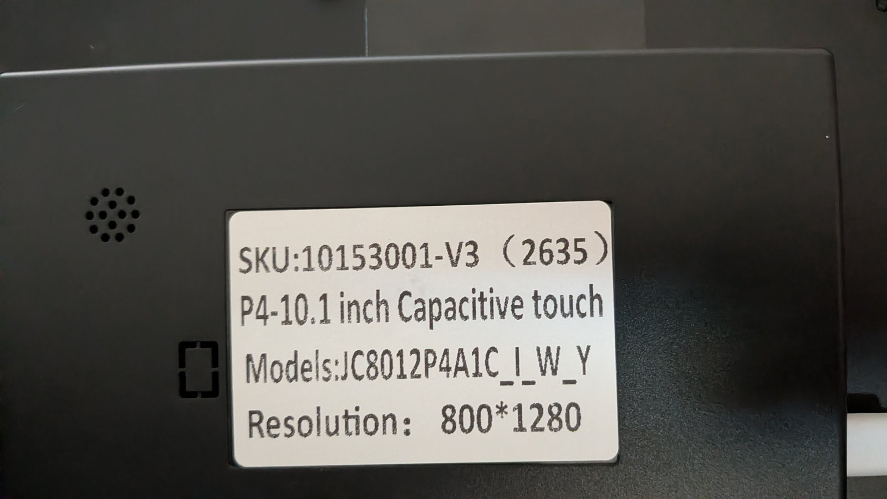
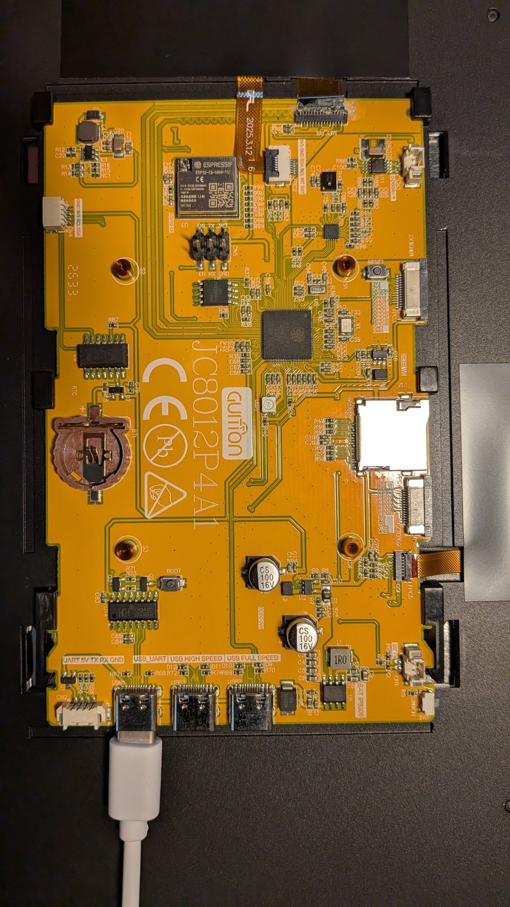

# lcd-touchscreen

ESPHome + LVGL firmware turning a **Guition JC8012P4A1C** 10.1" touch panel into a
Home Assistant wall dashboard (lights, switches, thermostat).

## Hardware

| Item | Value |
|------|-------|
| Board | Guition JC8012P4A1C-I-W-Y, SKU 10153001-v3 (batch 2635) |
| SoC | ESP32-P4, production silicon v3.x (`engineering_sample: false`) |
| WiFi/BLE | ESP32-C6 co-processor over SDIO (`esp32_hosted`) |
| Display | 10.1" 800x1280 MIPI-DSI, ESPHome model `JC8012P4A1-V2` (batch >= 2624) |
| Touch | GSL3680 at I2C 0x40, vendored `gsl3680` driver (`components/gsl3680`) |
| Flash / PSRAM | 16 MB / hex-mode PSRAM |
| Backlight | LEDC PWM on GPIO23 |
| Serial | USB-C port marked **USB_UART** (CH340, `/dev/ttyUSB0`), so `logger: hardware_uart: UART0` |
| Power | Needs a direct USB port or 5 V / 2 A supply. A dock port left touch dead (see Troubleshooting) |

Older units (batch < 2624) need `model: JC8012P4A1`; units with pre-v3 P4 silicon need
`engineering_sample: true`. Both are in `packages/hardware.yaml`.

<p>
  
</p>

The rear label gives the SKU and batch number (here `10153001-V3 (2635)`), which decide the
display model above.

<p>
  
</p>

With the back cover off: the board has three USB-C ports along the bottom edge. Flash and read
logs through the left one, marked **USB_UART**. The other two are the P4's high-speed and
full-speed USB. The ESP32-C6 WiFi module sits near the top, and the BOOT and RESET buttons are
on the board if a flash ever needs manual download mode.

## Layout

```
panel.yaml               entry point: substitutions (device name, HA entity ids) + packages
packages/hardware.yaml   P4, C6 hosted WiFi, PSRAM, LDO, I2C, touch, display, backlight
packages/core.yaml       API, OTA, logger, WiFi, time, diagnostics
packages/c6_update.yaml  C6 co-processor firmware updater (visible in HA)
packages/ha_entities.yaml  HA state mirrored into the panel (sensors / binary sensors)
packages/lvgl_theme.yaml fonts, colors, styles, screensaver
packages/lvgl_pages.yaml the dashboard pages
components/mipi_dsi/     patched copy of the ESPHome display driver (see Troubleshooting)
components/gsl3680/      touch driver (espcontrol copy of kvj's) + Guition demo firmware table
docs/images/             photos used in this README
```

## Setup

ESPHome 2026.7+ needs Python 3.12. Debian 12 ships 3.11, so the venv uses a
`uv`-managed interpreter:

```
python3 -m venv /tmp/uvboot && /tmp/uvboot/bin/pip install uv   # PEP 668 blocks pip --user
/tmp/uvboot/bin/uv venv --python 3.12 .venv                       # downloads CPython 3.12
/tmp/uvboot/bin/uv pip install --python .venv/bin/python -r requirements.txt
cp secrets.yaml.example secrets.yaml   # then edit
```

## Build and flash

```
.venv/bin/esphome config panel.yaml                     # validate
.venv/bin/esphome run panel.yaml --device /dev/ttyUSB0  # first flash over USB-C
.venv/bin/esphome run panel.yaml                        # later: OTA
.venv/bin/esphome logs panel.yaml --device /dev/ttyUSB0 # serial log
```

Then in Home Assistant: Settings > Devices > ESPHome, add the discovered device and enable
**"Allow the device to perform Home Assistant actions"** on the integration entry. Without it
the panel can read state but the buttons do nothing.

## Dashboard

Single landscape page: four light cards (tap toggles, slider sets brightness), four switch
cards (tap toggles), and a full-width thermostat card (current temperature, setpoint with
+/- buttons, heat / cool / auto / off mode buttons). State is mirrored from HA through
`packages/ha_entities.yaml`, so cards follow changes made elsewhere.

All entity ids and card labels are substitutions at the top of `panel.yaml`
(`light_1` / `light_1_name`, `switch_1`, `climate_main`, `temp_unit`, `temp_step`).
Change them there, then `esphome run panel.yaml` to push over the air.

Screensaver: backlight dims to 20 % after 2 min idle and turns off after 10 min; any touch wakes
it. The backlight is also a light entity in HA (`Display Backlight`).

## Troubleshooting

- **Boot loop with `abort() ... _mipi_dsi_ll_set_phy_pllref_clock_source`**: ESPHome 2026.9.0
  passes the legacy DPHY clock source, which ESP-IDF rejects on P4 v3.x silicon. `components/mipi_dsi`
  is a local copy with upstream fix esphome/esphome#18984; `packages/hardware.yaml` loads it via
  `external_components`. Drop both once on ESPHome >= 2026.10.

- **Black or garbled screen**: try `model: JC8012P4A1` (older panel revision).
- **Touch does nothing / log shows `GSL3680 firmware did not start`**: the panel is
  underpowered. Through a USB dock port the touch controller accepted its firmware upload but
  never started it (RAM marker at 0xB0 stayed 0). Plugged directly into a laptop port it
  starts first try. Use a direct port or a proper 5 V / 2 A supply. The backlight is held off
  until boot finishes to reduce the load while the touch controller starts.
- **One tap toggles twice**: the GSL3680 sometimes splits a tap into two presses. Every card
  action goes through `tap_allowed()` in `packages/tap_guard.h`, which ignores a second tap
  within 400 ms.
- **Touch mirrored/offset**: add a `transform:` block to the touchscreen (the model preset is
  usually right; the espcontrol project uses `mirror_x: true, mirror_y: false`).
- **Boot loop with `HS_MP: mempool create failed`**: keep `CONFIG_ESP_HOSTED_USE_MEMPOOL: "n"`.
- **No application logs on USB**: `logger: hardware_uart: UART0` must be set.
- **Buttons do nothing**: see the HA permission note above.
